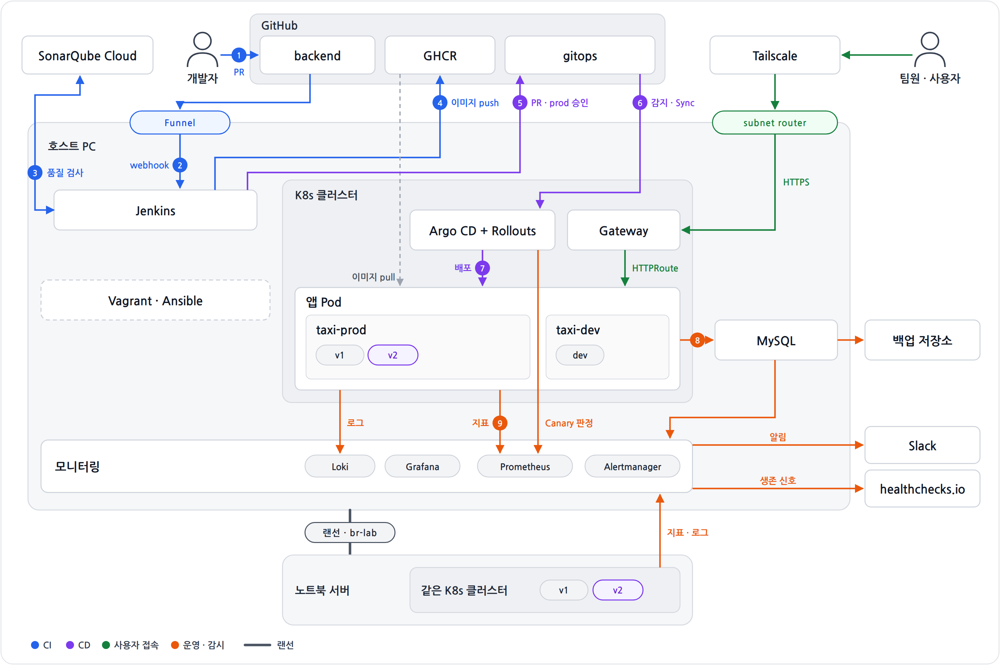
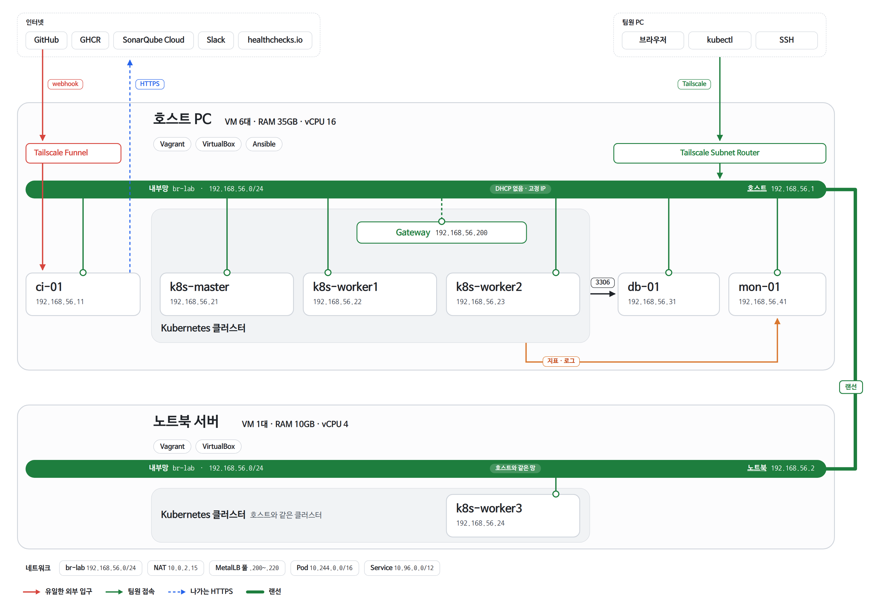
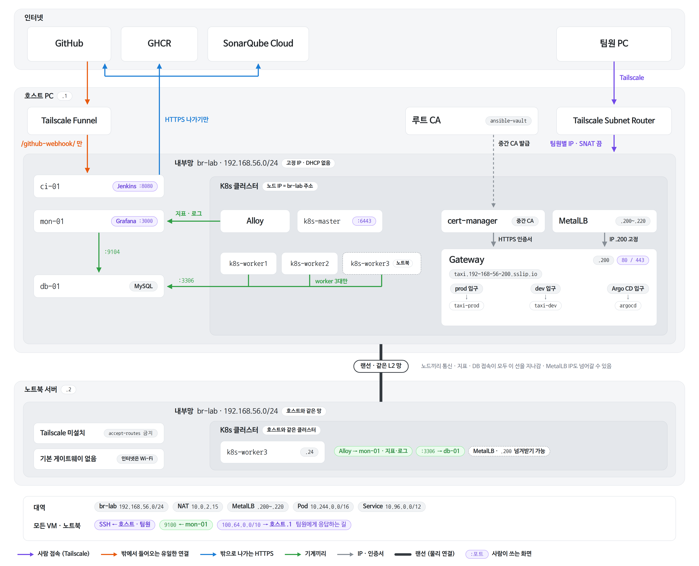

# DevOps_Infra

택시 배차 서비스 DevOps 프로젝트의 **인프라 저장소**.
물리 서버 2대(호스트 PC, 노트북 서버) 위의 VirtualBox VM을 **Vagrant**로 만들고, 서버 설정은 **Ansible**로 적용한다.

> 설계 기준: 노션 「프로젝트 아키텍처」. 전체 내용(CI·CD·앱/DB·모니터링 포함)은
> **[docs/architecture.md](docs/architecture.md)** 에 옮겨 두었고, 이 README는 인프라 부분만 정리한다.
> 서로 다르면 노션이 기준이다.

| 저장소 | 역할 |
|---|---|
| DevOps_Backend | 앱 코드, Dockerfile, Jenkinsfile |
| DevOps_GitOps | 배포 상태(Kustomize, Argo CD) |
| **DevOps_Infra** (이 저장소) | Vagrantfile, Ansible |
| DevOps_Docs | 확정 문서, ADR, Runbook |

---

## 1. 전체 구조



| 부분 | 하는 일 |
|---|---|
| **CI** | 테스트 → 품질 검사(SonarQube Cloud) → Docker 이미지 → GHCR 저장(공개) |
| **CD** | gitops 저장소의 이미지 digest를 바꾸면 Argo CD가 클러스터에 반영. prod는 Canary + 자동 롤백 |
| **운영** | 앱이 DB를 쓰고, Prometheus가 감시하고, 문제가 생기면 Slack으로 알림 |

- **실행 환경:** Private(온프레미스). 앱·DB·CI·모니터링이 전부 팀이 관리하는 PC 2대 안에서 돈다.
- **한계:** 호스트 PC가 꺼지면 전체가 멈춘다(master·DB·모니터링이 호스트에 있음).
  노트북 서버가 꺼지면 worker3만 빠지고 서비스는 계속된다.

## 2. 물리 서버

| 머신 | 사양 | br-lab IP | 올라가는 VM |
|---|---|---|---|
| **호스트 PC** | Ubuntu 24.04, 16스레드, RAM 62GiB, SSD 476GB | 192.168.56.1 | ci-01, k8s-master, k8s-worker1·2, db-01, mon-01 |
| **노트북 서버** | Ubuntu Server 24.04.5, 12스레드(저전력), RAM 32GB, SSD 238GB | 192.168.56.2 | k8s-worker3 |

- 두 머신의 유선 랜포트를 랜선 한 줄로 직접 연결한다(공유기·스위치 없음). 인터넷은 각 머신의 Wi-Fi로 나간다.
- 노트북은 덮개를 닫아도 꺼지지 않게(lid 무시) 하고 절전·최대 절전을 끈다.
- Vagrant는 머신마다 실행하고, **Ansible은 호스트에서만** 실행한다.

## 3. VM 구성



| VM | IP | vCPU | RAM | 디스크 | 머신 | 역할 |
|---|---|---|---|---|---|---|
| ci-01 | .11 | 2 | 8GB | 50GB | 호스트 | Jenkins, Docker |
| k8s-master | .21 | 2 | 4GB | 31GB | 호스트 | Control Plane (앱 없음) |
| k8s-worker1 | .22 | 4 | 8GB | 50GB | 호스트 | 앱, Gateway, 플랫폼 도구 |
| k8s-worker2 | .23 | 4 | 8GB | 50GB | 호스트 | 〃 |
| k8s-worker3 | .24 | 4 | 10GB | 50GB | 노트북 | 〃 (실제 머신 장애 데모용) |
| db-01 | .31 | 2 | 3GB | 50GB | 호스트 | MySQL 8.4 LTS |
| mon-01 | .41 | 2 | 4GB | 50GB | 호스트 | Prometheus, Alertmanager, Grafana, Loki |

- 모든 VM: Ubuntu 24.04, 시간대 KST, swap 끔(kubeadm 요구사항), 관리 계정 `devops`(키 인증만).
- 디스크: bento 박스 디스크는 64GB 동적 할당이고 루트 볼륨은 약 31GB로 시작한다. `bootstrap.sh`가 표의 크기까지 늘린다.
- Kubernetes는 master 1 + worker 3. worker 3대는 같은 구성이고, 노드에 머신 라벨
  `topology.kubernetes.io/zone=host|laptop`을 붙여 prod Pod를 머신마다 1개씩 나눈다.
- 자원: 호스트 RAM 35GB / vCPU 16(16스레드와 같음, 초과 할당 없음). 노트북 RAM 10GB / vCPU 4.

## 4. 네트워크



| 이름 | 대역 | 역할 |
|---|---|---|
| **내부망 br-lab** (VM `eth1`) | 192.168.56.0/24 | 두 머신과 모든 VM이 쓰는 내부망 |
| **NAT** (VM `eth0`) | VM마다 10.0.2.15 | VM 인터넷용. 각 머신의 Wi-Fi로 나감 |
| **MetalLB 풀** | .200 ~ .220 | Gateway 외부 IP(.200 고정) |
| **Pod / Service** | 10.244.0.0/16 / 10.96.0.0/12 | 클러스터 내부 전용 |

**주소 배정** — 아래만 고정으로 쓰고 나머지는 비워 둔다.
`.1` 호스트 · `.2` 노트북 · `.11` ci-01 · `.21` master · `.22~.24` worker1~3 · `.31` db-01 · `.41` mon-01 · `.200~.220` MetalLB

**br-lab**
- 각 머신의 리눅스 브리지에 유선 랜포트와 `dummy0`을 붙인다. `dummy0` 덕분에 랜선이 빠져도 br-lab이 내려가지 않는다.
- 기본 게이트웨이 없음, DHCP 없음(MetalLB 풀과 겹칠 수 있음). 모든 장비가 고정 IP를 쓴다.
- 브리지를 쓰는 이유: MetalLB L2는 ARP로 IP를 알리므로 모든 worker가 같은 L2 망에 있어야 한다. Host-Only는 노트북의 VM이 들어올 수 없다.
- 예전 Host-Only `vboxnet0`은 같은 대역이라 지운다.

**꼭 지킬 것**
- Calico 기본 대역(192.168.0.0/16)은 br-lab과 겹친다. **10.244.0.0/16으로 지정**한다.
- NAT 주소(10.0.2.15)는 모든 VM이 같다. **kubelet·kubeadm·Calico 세 곳에 eth1(br-lab) 주소를 지정**한다.

**원격 접속 (Tailscale)**
- 호스트 PC 하나만 Subnet Router로 192.168.56.0/24를 팀원에게 연다. VM에는 Tailscale을 깔지 않는다.
- 노트북에는 Tailscale을 설치하지 않는다(설치해도 `--accept-routes` 금지).
- 목표: SNAT를 끄고 VM·노트북에 `100.64.0.0/10 via 192.168.56.1` 경로를 넣어 팀원별 IP가 보이게 한다(fail2ban 사람 단위 차단). **Ansible 적용 전까지는 SNAT 켜 둠.**
- 외부에서 들어오는 길은 하나뿐: GitHub → Tailscale Funnel(호스트) → ci-01:8080 `/github-webhook/`.

**포트 요약**

| 대상 | 포트 | 허용 |
|---|---|---|
| 모든 VM·노트북 SSH | 22 | 내부망, Tailscale |
| Jenkins | 8080 | 내부망, Tailscale (`/github-webhook/`만 Funnel) |
| Grafana (mon-01) | 3000 | 내부망, Tailscale |
| Gateway | 80 / 443 | 내부망, Tailscale |
| Kubernetes API | 6443 | 호스트, 팀원 kubectl |
| node_exporter / mysqld_exporter | 9100 / 9104 | mon-01 |
| MySQL (db-01) | 3306 | worker 3대(.22~.24)만. 사람은 SSH 터널 |

## 5. 보안

| 영역 | 내용 |
|---|---|
| 접근 | Tailscale, SSH 키 인증, fail2ban(호스트 .1은 차단 예외). 노트북 OS에도 같은 기준 + ufw |
| 비밀값 | Sealed Secrets(클러스터), Jenkins Credentials(CI), ansible-vault(Ansible, Sealed Secrets 키·루트 CA 키) |
| 저장소 | public. GitHub secret scanning·push protection |
| 시간 | chrony |
| 외부 노출 | `/github-webhook/` 하나만 Funnel, webhook secret으로 서명 확인 |

**저장소 규칙**
- `keys/`에는 **공개키(`*.pub`)만** 올린다. 비밀키는 각자 PC에만 둔다.
- 비밀번호, 토큰, `ansible-vault` 비밀번호를 커밋하지 않는다.

## 6. 진행 현황

| 단계 | 상태 |
|---|---|
| br-lab(호스트·노트북), Tailscale 서브넷 라우터 | ✅ |
| Vagrant: VM 7대 생성, KST·swap·`devops` 계정·공개키 | ✅ |
| 머신 재부팅 시 VM 자동 기동(`install-autostart.sh`) | ⏳ 두 머신에서 1회 실행 필요 |
| Ansible 뼈대(inventory, ansible.cfg) + common role (chrony, /etc/hosts, SSH 하드닝, fail2ban, node_exporter, Tailscale 복귀 경로) | 🛠 코드 작성, VM 적용 전 |
| 호스트 SNAT 끄기(노트북 복귀 경로 포함) | ⏳ common 적용 + host role 후 |
| Kubernetes(kubeadm, Calico), MySQL, Jenkins | ⏳ |
| Calico·Argo CD 설치 후 GitOps(App of Apps)로 나머지 | ⏳ |
| 모니터링(mon-01), 백업·healthchecks cron | ⏳ |

---

## 7. 사용법

### 7-1. 사전 준비 (각 머신)
1. VirtualBox 7.2와 최신 Vagrant를 설치한다.
2. br-lab을 만든다(§4). 없으면 `vagrant up`이 실패한다.
   - 호스트(NetworkManager): `nmcli`로 bridge `br-lab`(192.168.56.1/24) + 랜포트·`dummy0`
   - 노트북(netplan): `/etc/netplan/60-br-lab.yaml`에 랜포트(dhcp 끔) + `dummy-devices: dummy0` + `bridges: br-lab`(192.168.56.2/24)

### 7-2. 공개키 추가 (팀원)
```bash
ssh-keygen -t ed25519 -C "이름@devops"      # 비밀키는 절대 공유하지 않음
```
공개키(`.pub`)만 `keys/이름.pub`으로 PR을 올린다. `keys/`에 공개키가 없거나 비밀키가 있으면 `vagrant up`이 중단된다.

### 7-3. VM 실행
```bash
vagrant up                  # 호스트: 6대 / 노트북: k8s-worker3 (br-lab 주소 .1/.2로 자동 구분)
LAB_MACHINE=laptop vagrant up   # 직접 고를 때 (host | laptop). br-lab 주소로 알 수 없으면 중단된다

vagrant status
vagrant halt <이름>
vagrant reload <이름>       # 스펙 변경 반영
vagrant destroy -f <이름>
```

- **박스 버전:** `Vagrantfile`의 `BOX_VERSION`에 두 머신이 쓰는 bento 박스 버전을 적는다(`vagrant box list`로 확인).
  지금 값은 `202510.26.0`. 비어 있으면 매번 경고가 나온다. 바꾸면 새로 만드는 VM에만 적용된다.

### 7-4. 재부팅 시 자동 기동 (각 머신 1회)
```bash
./scripts/install-autostart.sh      # systemd 서비스 vagrant-vms 등록 (br-lab 주소로 host/laptop을 정해 서비스에 고정)
systemctl status vagrant-vms
```
- 재부팅 후 VM이 차례로 뜨는 데 몇 분 걸린다. 그동안 `activating (start)`로 보인다.
- 머신을 끌 때 이 서비스가 `vagrant halt`로 VM을 정상 종료한다. 터미널에서 직접 `vagrant up`으로 켠 VM은
  종료 순서가 보장되지 않으므로(`aborted`로 꺼질 수 있음) 전체 기동·종료는 서비스로 한다.
  ```bash
  sudo systemctl stop vagrant-vms     # 이 머신의 VM 정상 종료
  sudo systemctl start vagrant-vms    # 이 머신의 VM 기동
  ```

### 7-5. 공개키 반영
`bootstrap.sh`는 VM을 처음 만들 때만 자동 실행된다. 키를 추가·삭제하면 **두 머신 모두**에서 실행한다.

| 상황 | 명령 |
|---|---|
| 켜져 있는 VM | `vagrant provision <이름>` |
| 꺼져 있는 VM | `vagrant up --provision <이름>` |
| 스냅샷 복원 후 | `vagrant provision <이름>` |

### 7-6. 접속 (팀원 PC)
1. Tailscale 초대 수락 → 앱 설치 → 같은 계정으로 로그인 → `ping 192.168.56.21`
2. `~/.ssh/config`:
   ```
   Host ci-01
     HostName 192.168.56.11
   Host k8s-master
     HostName 192.168.56.21
   Host k8s-worker1
     HostName 192.168.56.22
   Host k8s-worker2
     HostName 192.168.56.23
   Host k8s-worker3
     HostName 192.168.56.24
   Host db-01
     HostName 192.168.56.31
   Host mon-01
     HostName 192.168.56.41

   Host ci-01 k8s-master k8s-worker1 k8s-worker2 k8s-worker3 db-01 mon-01 192.168.56.*
     User devops
     IdentityFile ~/.ssh/id_ed25519
     IdentitiesOnly yes
   ```
3. `ssh k8s-master`

### 7-7. 기동 후 확인
```bash
ssh k8s-master 'hostname; date; swapon --show | wc -l; sudo -n true && echo sudo-ok'
# 기대 결과: 호스트명, KST 시각, swap 0, sudo-ok
```

## 8. Ansible

호스트 PC에서만 실행한다. 대상은 VM 7대 + 노트북 + 호스트 자신. 팀원은 코드를 PR로 올리고, 머지 후 호스트에서 적용한다.

```
ansible/
├── ansible.cfg                 # inventory, remote_user=devops, 키 ~/.ssh/ansible_key
├── .ansible-lint
├── inventory/hosts.yml         # vms(ci, k8s_master, k8s_workers, db, mon) + machines(lab-host, lab-laptop)
├── group_vars/all.yml          # br-lab 대역, eth1, 호스트 .1, Tailscale 대역
├── site.yml                    # 지금은 vms 에 common 만 적용
└── roles/common                # ✅ 작성됨
```
`group_vars/vault.yml`과 나머지 role(host, k8s_*, mysql, jenkins, monitoring)은 아직 없다.

### 8-1. 실행
```bash
sudo apt install ansible-core     # 호스트 PC, 1회
cd ansible
ansible vms -m ping               # 7대 모두 pong 이어야 한다
ansible-playbook site.yml --check --diff     # 바뀔 내용 미리 보기
ansible-playbook site.yml                    # 적용
ansible-playbook site.yml --limit k8s-worker3 --tags fail2ban   # 일부만
```
- Ansible 키(`keys/ansible.pub`의 짝)가 `~/.ssh/ansible_key`가 아니면 `ANSIBLE_PRIVATE_KEY_FILE=<경로>`를 붙인다.
- 처음 보는 VM 호스트 키는 자동으로 받는다. VM을 다시 만들어 키가 바뀌면 `ssh-keygen -R 192.168.56.xx` 후 다시 실행한다.

### 8-2. common role
| 태그 | 내용 |
|---|---|
| (항상) | 접속 계정이 `AllowUsers`에 있는지, eth1에 인벤토리 주소가 있는지 먼저 확인. 아니면 멈춤(잠금 방지) |
| `chrony` | chrony 설치·실행(timesyncd 대체, Ubuntu 기본 NTS 서버). 시간대가 KST가 아니면 맞춤 |
| `hosts` | `/etc/hosts`에 인벤토리 전체(VM 7대, `lab-host`, `lab-laptop`) 등록 |
| `ssh` | `sshd_config.d/10-hardening.conf`: root 로그인·비밀번호 로그인 금지, 키 인증만, `AllowUsers devops vagrant` |
| `fail2ban` | sshd jail, journald 읽기, 호스트 .1 차단 예외(5회/10분 → 1시간) |
| `node_exporter` | Ubuntu 패키지, eth1 주소 `:9100`에서만 수신 |
| `tailscale` | `100.64.0.0/10 via 192.168.56.1 dev eth1` 경로(지금 바로 + netplan `60-tailscale-route.yaml`로 재부팅 후에도) |

- `vagrant` 계정은 `vagrant ssh`·`vagrant provision`(공개키 배포)에 필요해서 허용한다. 빼면 키 배포가 안 된다.
- `authorized_keys`는 Ansible에서 건드리지 않는다(`keys/` + `vagrant provision`으로만 관리).

### 8-3. 호스트 SNAT 끄기 (common 적용 후)
VM 7대에 복귀 경로가 들어가도 **노트북(.2)에는 아직 없다**(host role 예정). 노트북까지 경로를 넣은 뒤에 끈다.
```bash
ssh k8s-worker3 'ip route show 100.64.0.0/10'     # 모든 VM·노트북에서 via 192.168.56.1 확인
sudo tailscale set --snat-subnet-routes=false      # 호스트 PC
# 되돌리기: sudo tailscale set --snat-subnet-routes=true
```

### 8-4. 앞으로 만들 role
| 순서 | role | 내용 |
|---|---|---|
| 1 | host | 호스트·노트북: node_exporter. 노트북: ufw, fail2ban, Tailscale 복귀 경로 |
| 2 | k8s_node / master / worker | containerd, kubeadm(node-ip=eth1, pod CIDR 10.244.0.0/16, serverTLSBootstrap), zone 라벨 |
| 2 | mysql | MySQL 8.4, `taxi_dev`·`taxi_prod`, utf8mb4, ufw 3306은 .22~.24만, mysqld_exporter |
| 2 | jenkins | Docker, Jenkins(JCasC), 동시 빌드 1개 |
| 3 | k8s_master | Calico(`interface=eth1`) → Argo CD → 루트 Application |
| 3 | monitoring | Prometheus(30일), Alertmanager→Slack, Grafana, Loki(7일) |
| 4 | host | healthchecks.io cron, DB 백업 cron |

## 9. 브랜치 규칙

- `main` 하나. `feature/<번호>-<내용>` 브랜치 → PR(승인 1명) → **Squash** 머지. `main`에 직접 push하지 않는다.
- 브랜치명에 `#`을 넣지 않는다.

## 10. 파일 구성

| 경로 | 설명 |
|---|---|
| `Vagrantfile` | VM 7대 정의. 머신(host/laptop)을 br-lab 주소로 구분, 박스 버전 고정, 스펙, IP, SSH 포트(2201~2208) |
| `scripts/bootstrap.sh` | 최소 부트스트랩: KST, swap 해제, SSH 호스트 키 재생성, `devops` 계정, sudo NOPASSWD, 공개키 배포, 루트 볼륨 확장 |
| `scripts/install-autostart.sh` | 머신 재부팅 시 VM 자동 기동(systemd) 등록 |
| `keys/` | 팀원 공개키(`*.pub`)만 |
| `docs/architecture.md` | 노션 「프로젝트 아키텍처」 전체 사본 |
| `docs/*.png` | 아키텍처 그림 (전체, VM 배치, 네트워크, CD, 모니터링) |
| `ansible/` | 서버 설정. 지금은 inventory, ansible.cfg, common role (§8) |

## 알아둘 점
- **스냅샷:** `vagrant snapshot save <이름> base-clean`으로 초기 상태를 저장해 두면 복구가 쉽다. 같은 디스크에 저장되므로 백업은 아니다.
- **linked clone:** VirtualBox에 `ubuntu-24.04-amd64_...` 이름의 원본 VM이 생긴다. 모든 VM이 이 디스크를 공유하므로 삭제하거나 켜지 않는다.
- **노트북도 같은 `Vagrantfile`을 쓴다.** 예전 `Vagrantfile.laptop`과 `VAGRANT_VAGRANTFILE` 환경변수는 쓰지 않는다.
- **장애 시:** 노트북이 꺼지거나 랜선이 빠지면 worker3만 NotReady가 되고 prod는 호스트의 worker로 계속 응답한다.
