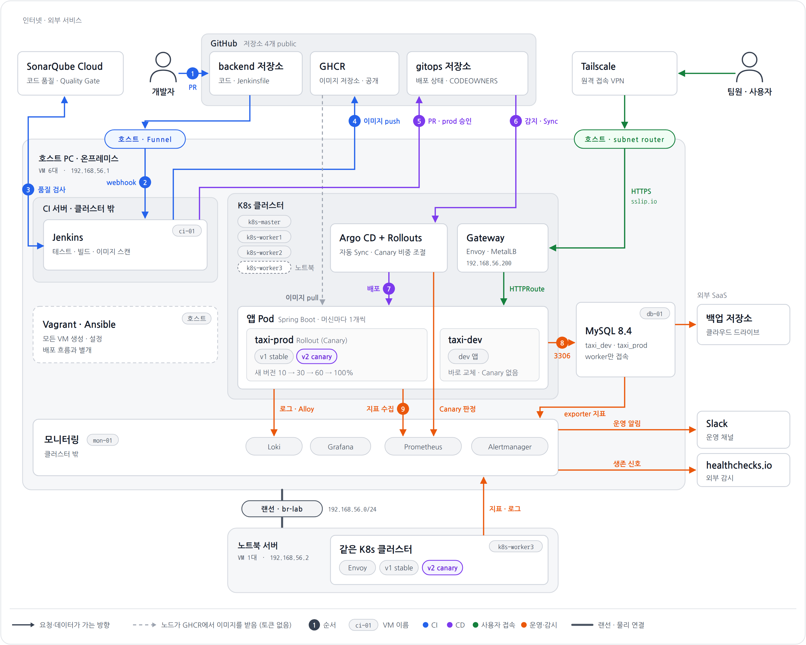
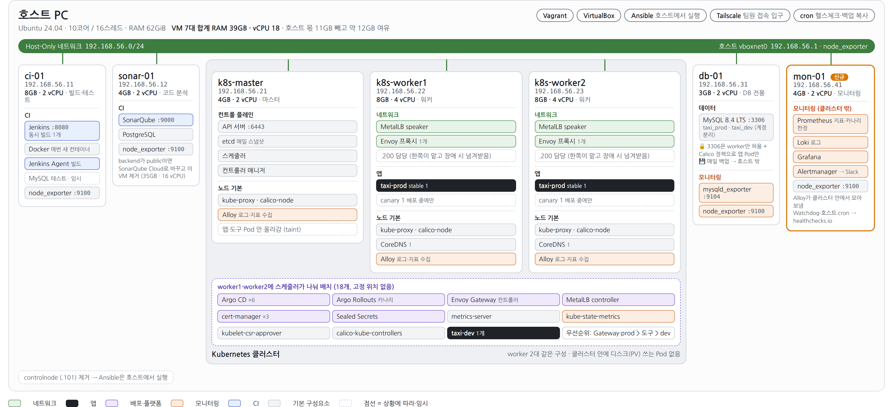
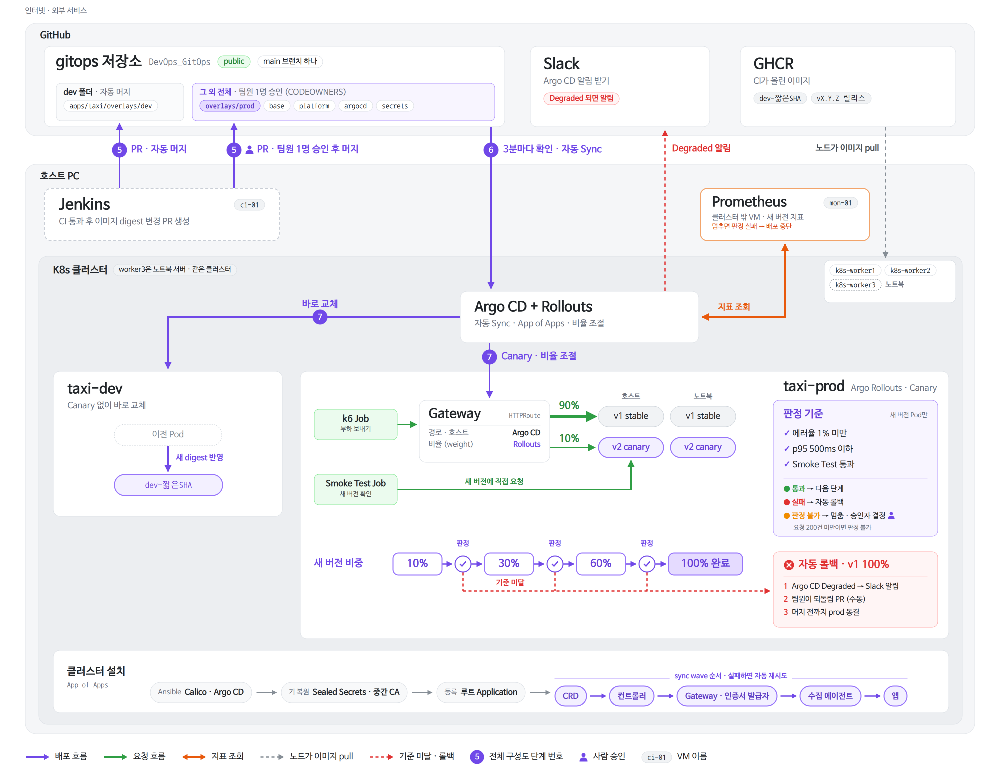
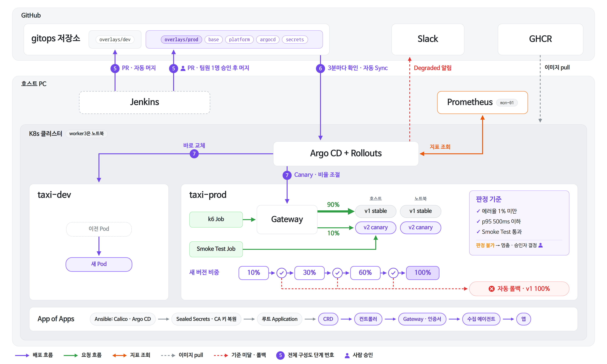
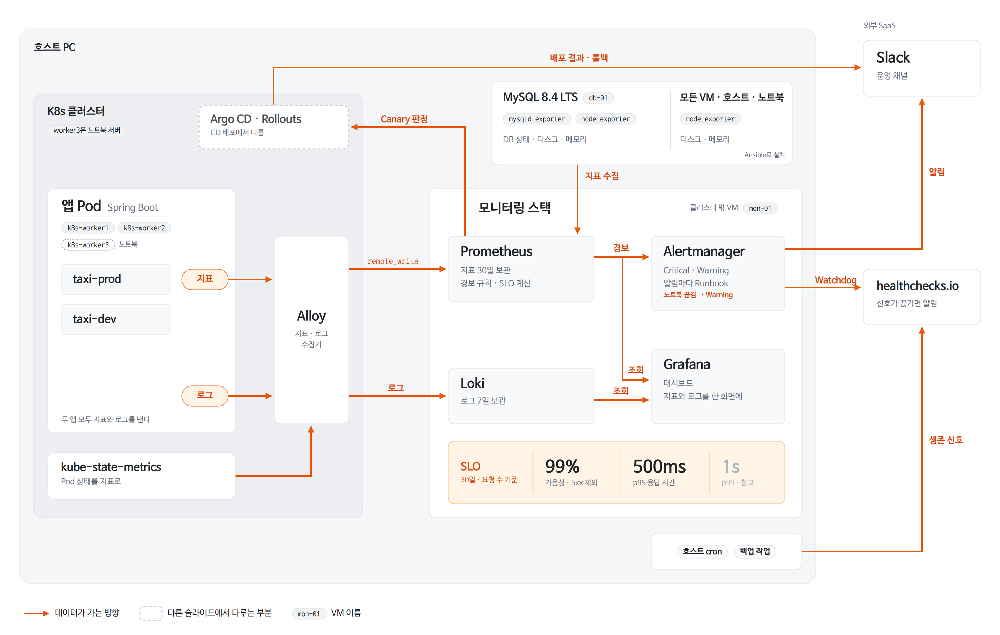
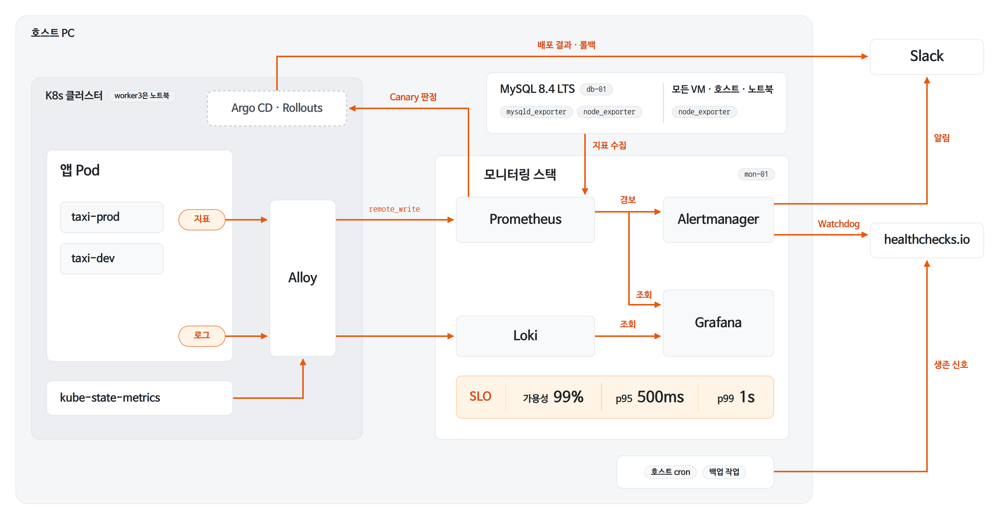

# 프로젝트 아키텍처

> 노션 「프로젝트 아키텍처」를 옮긴 사본(2026-10-06 기준). 문서가 바뀌면 노션이 기준이다.
> 5장 CI 흐름 그림은 노션에서 본다.

장 순서대로 **무엇을 하는지 → 왜 그렇게 했는지**를 설명함.

---

## 0. 문서 맨 위 안내 박스
- **상태:** "회의 전 초안"임. 지금 있는 환경이 아니라 **앞으로 만들 모습(To-be)**을 적은 문서이며, 현재 상태는 「현재 환경 현황」 문서에서 따로 다룸
- **범례:** 세 가지 표시를 씀
  - ✅ 팀이 이미 결정한 것
  - 💡 제안이라 회의에서 확인할 것
  - ❓ 아직 정하지 못한 것
- **범위:** 이 문서는 **구조만** 다룸. 팀원 권한, 시연 시나리오, 버전, 비용, 회의 안건은 「보류 항목」 페이지로 옮김. 백업은 정책이 정해져 7장에 넣음
- **결정 근거:** 문제점과 해결방안 결정은 노션 「아키텍처 수정안」에 번호별로 정리함. 해결하지 않고 감수하기로 한 한계(14·16·18·20·21·23·24번)도 그 문서에 있음
- **수정 이력:** Ingress를 Gateway API로 바꾼 것과 1\~4차 검토 내역이 있음
  - 2026-10-01: MySQL을 8.4 LTS로 바꾸고 Wazuh 미도입 확정(sec-01 제외, ci-01·worker1 8GB). vboxnet0 DHCP는 쓰지 않기로 하고, VM별 vCPU·디스크를 3장 표에 넣음
  - 2026-10-04: VM 재구성. 모니터링을 클러스터 밖 mon-01로 분리하고, worker 2대를 같은 구성으로 맞추고, controlnode를 제거함(3·4·6·8·9·11장)
  - 2026-10-04: 아키텍처 수정안 반영. 저장소 4개 public 전환, Jenkins 변경 감지를 webhook(Tailscale Funnel)으로 변경, SonarQube Cloud 도입(sonar-01 제거), GHCR 이미지 공개, 브랜치 규칙·CODEOWNERS 확정, 이미지 digest 지정, 자체 CA 범위 제한, 백업 정책 확정. 문서 말투를 명사형으로 바꿈(전 장)
  - 2026-10-05: 노트북 서버 추가. 호스트와 랜선으로 연결하고 k8s-worker3(.24)을 둠. 내부망을 Host-Only에서 br-lab 브리지로 바꿈(1·2·3·4·6·7·8·9·11장)

---

## 1장. 프로젝트 개요
**한 줄 요약:** 택시 배차 앱을 만들고, 코드를 올리면 **테스트 → 품질 검사 → 이미지 생성 → 배포 → 감시**가 자동으로 이어지는 파이프라인을 만드는 프로젝트임. prod에 문제가 있는 새 버전이 나가면 자동으로 이전 버전으로 되돌림. dev는 자동 배포만 하고 자동으로 되돌리지는 않음

| 트랙 | 의미 |
|---|---|
| 앱 | 사용자·기사·차량·호출을 관리하는 기능(CRUD)과, 호출 → 수락 → 도착 → 시작 → 완료/취소로 이어지는 상태 흐름. Java 21, Spring Boot, MySQL 8.4 LTS, Flyway(DB 테이블 변경 이력 관리) |
| 인프라 | Jenkins(CI), SonarQube Cloud(품질 검사), Argo CD(GitOps 배포), Argo Rollouts(Canary 배포), Prometheus·Grafana(모니터링) |
| 실행 환경 | Private(온프레미스). 개인 PC 2대(호스트 PC, 노트북 서버) 위의 VM |
| 보안 | Tailscale, SSH 키 인증, fail2ban, Sealed Secrets, Trivy, GitHub secret scanning (9장). Wazuh는 도입하지 않음 |

**클라우드 형태가 왜 Private인가**
- 앱, DB, CI, 모니터링이 **전부 팀이 직접 관리하는 PC 2대(호스트 PC, 노트북 서버) 안에서** 돎
- GitHub·GHCR·SonarQube Cloud·Slack·Tailscale·healthchecks.io는 "가져다 쓰는 서비스(SaaS)"임. 우리 앱이 그 위에서 돌지 않으므로 Hybrid가 아님
- Public은 매달 비용이 들고, Hybrid는 VPN과 두 곳 동시 배포가 필요해 범위를 넘음
- **한계:** 호스트 PC가 꺼지면 모든 것이 멈춤(master·DB·모니터링이 호스트에 있음). 노트북 서버가 꺼지면 worker3만 빠지고 서비스는 계속됨. 자원은 두 머신 밖으로 늘릴 수 없으므로 3장의 메모리 계산이 중요함
- **확장 경로:** 모두 Kubernetes와 GitOps로 되어 있음. 클러스터만 EKS 같은 관리형 Kubernetes로 바꾸면 나머지는 거의 그대로 쓸 수 있음

---

## 2장. 전체 그림


전체 흐름을 세 덩어리로 나눔

| 부분 | 하는 일 | 비유 |
|---|---|---|
| **CI** | 테스트 → 품질 검사(SonarQube Cloud) → Docker 이미지 → GHCR 저장(공개) | "배포해도 되는지 확인하고 포장" |
| **CD** | gitops 저장소의 이미지(digest)를 바꾸면 Argo CD가 클러스터에 반영 | "포장한 새 버전을 서버에 올림" |
| **운영** | 앱이 DB를 쓰고, Prometheus가 감시하고, 문제가 생기면 Slack으로 알림 | "잘 도는지 지켜봄" |

- **사용자 요청이 가는 길:** 팀원 PC → Tailscale → 호스트 PC → 내부망(br-lab) → Gateway(MetalLB IP) → HTTPRoute → 앱 Pod. Gateway IP를 맡은 노드나 앱 Pod가 노트북의 worker3에 있으면 그 구간은 랜선을 지나감
- **GitHub 알림이 들어오는 길:** GitHub → Tailscale Funnel(호스트 PC) → Jenkins `/github-webhook/`. 밖에서 안으로 들어오는 유일한 길임(4장·9장)

---

## 3장. 물리 구성



### 물리 서버 2대
물리 서버는 호스트 PC와 노트북 서버 2대임. 두 머신을 랜선으로 직접 연결하고, 각 머신 안에 VirtualBox VM을 띄움

| 머신 | 사양 | 인터넷 | 올라가는 VM |
|---|---|---|---|
| **호스트 PC** | Ubuntu 24.04, 10코어/16스레드, RAM 62GiB, SSD 476GB | Wi-Fi | ci-01, k8s-master, k8s-worker1, k8s-worker2, db-01, mon-01 |
| **노트북 서버** (신규) | Ubuntu Server 24.04.5, i5-1235U 10코어/12스레드(저전력), RAM 32GB, SSD 238GB | Wi-Fi | k8s-worker3 |

- **연결:** 두 머신의 유선 랜포트를 랜선으로 직접 연결함(공유기·스위치 없음). 두 머신 모두 인터넷은 Wi-Fi로 쓰므로 랜포트가 비어 있음
- **같은 내부망:** 두 머신에 리눅스 브리지(br-lab)를 만들어 모든 VM이 한 내부망(192.168.56.0/24)에 있는 것처럼 동작하게 함. 호스트는 .1, 노트북은 .2를 쓰고 VM IP는 그대로 유지됨(자세한 내용은 4장)
- **노트북 서버 설정:** 화면을 닫아도 꺼지지 않게 하고(lid 무시), 절전·최대 절전을 끔. BIOS에서 가상화(VT-x)를 켬

### VM 구성

| VM | 하는 일 | RAM | vCPU | 디스크 | 사양 포인트 |
|---|---|---|---|---|---|
| **ci-01** (.11) | Jenkins와 Docker. 빌드와 테스트 | 8GB | 2 | 31GB (50GB로 확장 예정) | 빌드가 메모리를 많이 씀. Wazuh 미도입으로 6GB에서 8GB로 올림 |
| **k8s-master** (.21) | Kubernetes의 두뇌(Control Plane) | 4GB | 2 | 31GB | 앱은 올리지 않음 |
| **k8s-worker1** (.22) | 앱, 게이트웨이, 플랫폼 도구 (worker2·worker3과 같은 구성) | 8GB | 4 | 50GB | Wazuh 미도입으로 6GB에서 8GB로 올림 |
| **k8s-worker2** (.23) | 앱, 게이트웨이, 플랫폼 도구 (worker1·worker3과 같은 구성) | 8GB | 4 | 50GB | 모니터링을 mon-01로 옮겨 worker1과 역할을 같게 함 |
| **k8s-worker3** (.24) | 앱, 게이트웨이, 플랫폼 도구 (worker1·worker2와 같은 구성). **노트북 서버**에 둠 | 10GB | 4 | 50GB | 신규. 다른 물리 머신이라 머신 하나가 꺼져도 버티는 장애 복구를 실제로 보여 줌. 노트북 여유가 있어 2GB 더 줌 |
| **db-01** (.31) | MySQL 전용 | 3GB | 2 | 50GB | MySQL만 실행 |
| **mon-01** (.41) | Prometheus, Alertmanager, Grafana, Loki. 클러스터 밖 모니터링 | 4GB | 2 | 50GB | 신규. worker가 죽어도 모니터링·알림이 살아 있도록 클러스터 밖에 둠 |

vCPU·디스크는 노션 VM 사양 문서 기준. 디스크는 루트 볼륨 크기임

**자원 계산**
- **RAM**
  - 호스트: 6대 합계 35GB. controlnode(2GB)와 sonar-01(4GB)을 빼고 mon-01(4GB)을 더함. 호스트 자체가 약 11GB를 쓰므로 약 16GB가 남음
  - 노트북: worker3 10GB. 노트북 OS가 약 2\~3GB를 쓰므로 약 19GB가 남음
- **디스크:** 호스트 합계 262GB(ci-01을 50GB로 확장하면 281GB), 노트북 50GB. 쓰는 만큼만 늘어나는 동적 할당이라 실제 사용량은 더 적음
- **CPU**
  - 호스트: vCPU 합계 16개로 16스레드와 같아 초과 할당 없음. 그래도 빌드와 Canary가 CPU를 나눠 쓰므로 Jenkins 동시 빌드를 1개로 제한함
  - 노트북: worker3 vCPU 4개로 12스레드 중 일부만 씀. 저전력 CPU라 오래 부하를 주면 느려지므로 worker3에 무거운 작업을 고정 배치하지 않음
- **기타:** 모든 VM을 Vagrant로 만듦. Vagrant는 머신마다 실행하고(노트북은 worker3만), Ansible은 호스트에서 두 머신의 VM 전체를 설정함. 머신이 재부팅되면 VM이 자동으로 켜지게 하고, 시간대는 KST로 맞추고, swap은 끔(kubeadm 요구사항). Kubernetes는 master 1대와 worker 3대이며 master 다중화는 하지 않음

### 노드·Pod 배치 (어느 Pod가 어디에 뜨는가)

| 노드 | 올라가는 것 |
|---|---|
| master | Control Plane만. taint로 앱이 못 오게 막음 (kube-proxy·calico-node·Alloy만 함께 뜸) |
| worker1·worker2·worker3 (같은 구성) | MetalLB speaker, kube-proxy·calico-node, Alloy (모든 worker에 1개씩) |
| 머신마다 1개씩 | Envoy 프록시, prod 앱(Canary 중 +1), CoreDNS. 호스트 쪽 worker 1대와 노트북 worker3에 1개씩 뜸 |
| 스케줄러가 세 worker에 나눔 | Argo CD, Rollouts, Envoy Gateway 컨트롤러, cert-manager, Sealed Secrets, MetalLB controller, metrics-server, kube-state-metrics, kubelet-csr-approver, dev 앱 1개 |
| 클러스터 밖 (mon-01) | Prometheus, Grafana, Alertmanager, Loki |

**배치에서 짚을 점**
- **MetalLB L2 넘겨받기:** Gateway IP(.200)를 한 노드가 맡고 있다가 그 노드가 죽으면 다른 노드가 넘겨받음. 넘겨받기까지 수 초에서 수십 초 끊김. worker3도 같은 내부망(br-lab)에 있어서 넘겨받을 수 있음
- **metrics-server 인증서:** kubeadm의 kubelet 인증서는 자체 서명이라 그대로는 metrics-server가 접속하지 못함. kubelet 서빙 인증서를 발급(serverTLSBootstrap)받아 승인하는 방식을 씀. 1년마다 생기는 갱신 요청은 kubelet-csr-approver가 자동으로 승인함
- **도구 배치는 스케줄러에 맡김:** 고정 위치 없이 세 worker에 나눔. 노드가 죽으면 약 5분 뒤 남은 노드로 옮겨 감. 단, Argo CD 컨트롤러는 StatefulSet이라 자동으로 옮겨 가지 않으므로 장애 런북에 out-of-service taint 절차를 둠
- **Envoy 프록시 2개:** 기본값은 1개라서 EnvoyProxy 설정으로 2개를 띄우고, 머신 기준으로 나눠 호스트와 노트북에 1개씩 둠
- **CoreDNS는 worker에:** kubeadm은 CoreDNS를 master에 띄우는 경우가 많음. master를 피하게 옮겨서 master가 죽어도 앱이 이름으로 서비스를 찾을 수 있게 함
- **머신 기준 분산:** worker1·2는 같은 호스트에 있어서 노드 기준으로만 나누면 prod Pod가 전부 호스트에 몰릴 수 있음. 그래서 노드에 머신 라벨(`topology.kubernetes.io/zone=host` / `laptop`)을 붙이고 이 라벨 기준으로 나눔(topologySpreadConstraints). 노드 기준 분산도 함께 걸어서 Pod가 호스트로 모일 때 worker1·2에 고르게 뜨게 함
- **앱 분산:** `nodeTaintsPolicy: Honor`와 `matchLabelKeys`를 써서 평소에는 머신마다 1개, Canary Pod도 머신마다 1개씩 뜨고, 머신이나 노드가 죽으면 남은 노드에 다시 뜨게 함. prod에는 PodDisruptionBudget(minAvailable 1)을 둠

**장애가 나면**
- **장애 종류**
  - 노트북 장애(전원·랜선 빠짐): worker3만 빠지고 호스트의 worker 2대가 이어받음. prod는 계속 응답함
  - 호스트 worker 1대 장애: 남은 worker 2대(호스트 1 + 노트북 1)가 이어받음
  - 호스트 장애: master·DB·모니터링이 함께 꺼져 전체가 멈춤. 노트북만으로는 서비스하지 않음(1장 한계로 감수)
- **메모리:** worker 2대가 남는 경우는 여유가 있음. worker 1대(8GB)만 남는 경우까지 대비해 모든 Pod에 requests(최소 보장 자원)를 정하고 **우선순위(PriorityClass)**를 둠
  - 순서는 Gateway·prod 앱 \> 플랫폼 도구(Argo CD·Rollouts 등) \> dev 앱. 플랫폼 도구 등급을 기본값(globalDefault)으로 둬서 빠뜨린 Pod가 우선순위 0이 되지 않게 함. 자리가 모자라면 dev 앱부터 밀려남
  - worker 한 대로 버틸 때 필요한 메모리는 약 5.5GB(추정)라 8GB 안에 들어감. 설치 후 실제로 재서 조정함
  - Canary 중에는 prod Pod가 잠시 4개(기존 2개 + 새 버전 2개)가 되므로 이 몫도 계산에 넣음
- **모니터링:** 클러스터 밖 mon-01에 있어서 worker가 죽어도 장애를 기록하고 알림을 보냄. mon-01은 호스트에 있으므로 노트북 서버가 통째로 꺼져도 그 과정을 기록함
  - 클러스터 안에는 디스크(PV)를 쓰는 Pod가 없어서 local-path-provisioner가 필요 없음
  - mon-01이 멈추면 Canary 판정이 실패해 배포가 자동으로 중단됨. 그래서 sync window는 쓰지 않음
  - Alertmanager Watchdog과 **호스트 cron**이 healthchecks.io에 주기적으로 신호를 보냄. 신호가 끊기면 Slack으로 알려서 호스트 전체가 꺼진 경우까지 감지함

### 이렇게 나눈 이유
- **CI를 클러스터 밖에:** 빌드가 앱 자원을 뺏지 않고, 클러스터가 고장 나도 CI는 돎
- **SonarQube는 Cloud로:** 저장소가 public이라 SonarQube Cloud를 무료로 쓸 수 있고, 자체 운영(무료판)과 달리 PR 단계에서 검사할 수 있음. sonar-01 VM(4GB)이 없어져 메모리와 vCPU 초과 할당 문제도 함께 해결됨 ✅
- **worker 3대(호스트 2 + 노트북 1):** 한 노드가 죽어도 남은 노드가 응답하는 장애 복구를 보여 주기 위함. worker3은 **다른 물리 머신**이라 VM 끄기가 아니라 전원·랜선을 뽑는 실제 머신 장애를 보여 줄 수 있음. Canary 비율은 Gateway가 나누므로 노드 수와 상관없음
- **노트북에는 worker3만:** 꺼져도 prod에 영향이 없는 것만 둠. master·DB는 노트북이 꺼지면 전체 장애가 되고, mon-01은 노트북 장애를 지켜봐야 하므로 호스트에 둠. CI는 빌드 속도(노트북은 저전력 CPU)와 Funnel 위치 때문에 호스트에 둠
- **worker를 더 늘리지 않음:** 장애 단위는 노드 수가 아니라 물리 머신이라 노트북에 worker를 2대 둬도 함께 꺼짐. worker 1대로 버티는 데 필요한 메모리가 약 5.5GB라 용량도 충분함. k6 부하 테스트에서 부족하면 그때 추가함
- **모니터링을 클러스터 밖(mon-01)에:** DB를 밖에 둔 이유와 같음. worker가 죽어도 모니터링은 살아 있고, 클러스터를 다시 만들어도 지표·로그가 남음. 덕분에 세 worker를 같은 구성으로 맞출 수 있음
- **DB를 전용 VM에:** 클러스터를 다시 만들어도 데이터가 남음
- **controlnode 제거:** Vagrant 밖에 있는 유일한 VM이라 망가지면 다시 만들 수 없고, 비밀번호 없는 Ansible 키가 있는 곳이 하나 더 생김. VM을 만드는 Vagrant와 설정하는 Ansible을 호스트 한 곳에서 실행함

---

## 4장. 네트워크


### 네트워크 네 종류

| 이름 | 대역 | 역할 |
|---|---|---|
| **내부망** (br-lab) | 192.168.56.0/24 | 호스트(.1)·노트북(.2)과 모든 VM이 쓰는 내부망. 두 머신을 랜선으로 이어 하나의 망으로 씀. 모든 VM 주소가 여기 있음 |
| **NAT** | VM마다 10.0.2.15 | VM이 인터넷으로 나가는 통로. VM마다 따로라 주소가 같아도 충돌하지 않음. 각 머신의 Wi-Fi로 나감 |
| **MetalLB 풀** | .200\~.220 | Gateway가 쓰는 외부 IP. 클라우드의 로드밸런서 역할을 대신함 |
| **Pod·Service CIDR** | 10.244.0.0/16, 10.96.0.0/12 | 클러스터 안에서만 쓰는 가상 주소 |

**주의할 점**
- **Calico 기본 대역:** 192.168.0.0/16이라 내부망 대역(192.168.56.0/24)과 겹침. 반드시 10.244.0.0/16으로 지정함
- **노드 IP 고정:** VM에는 NAT(10.0.2.15)와 내부망(br-lab) 두 개의 주소가 있음. Kubernetes가 NAT 주소를 잘못 잡으면 Pod끼리 통신이 깨지므로 세 곳에 내부망 주소를 지정함
  - kubelet
  - kubeadm
  - Calico
- **DHCP 없음:** br-lab에는 DHCP 서버를 두지 않음 ✅. DHCP 서버는 고정 IP를 모르기 때문에 MetalLB 풀(.200\~.220)과 같은 주소를 다른 장비에 줄 수 있음. 그래서 두 머신과 모든 VM은 고정 IP를 씀

### 두 머신 연결 (br-lab)
- **구성:** 호스트 PC와 노트북 서버의 유선 랜포트를 랜선 한 줄로 직접 연결함(공유기·스위치 없음). 각 머신에 리눅스 브리지 br-lab을 만들고 유선 랜포트와 dummy0을 붙임
  - 호스트 PC: br-lab 192.168.56.1
  - 노트북 서버: br-lab 192.168.56.2
  - VM의 두 번째 네트워크 카드는 Host-Only 대신 br-lab에 브리지로 연결함(Vagrant `public_network`, `bridge: "br-lab"`). VM IP는 바뀌지 않음
- **브리지를 쓰는 이유:** MetalLB L2는 Gateway IP를 ARP로 알리므로 모든 worker와 Gateway로 접속하는 쪽(호스트)이 같은 L2 망에 있어야 함. Host-Only는 한 PC 안에서만 보이는 망이라 노트북의 worker3이 들어올 수 없음. 브리지로 묶으면 두 머신의 VM이 스위치 하나에 꽂힌 것처럼 동작함
- **dummy0:** 랜선이 빠져도 br-lab이 내려가지 않게 함. 노트북 장애 데모 중에도 호스트와 호스트 VM 사이 통신은 그대로 유지됨
- **기본 게이트웨이 없음:** br-lab에는 기본 경로를 두지 않음. 인터넷은 각 머신의 Wi-Fi로 나가고 br-lab은 내부 통신에만 씀
- **vboxnet0 삭제:** 기존 Host-Only(vboxnet0)는 지움. 남겨 두면 호스트에 같은 대역(192.168.56.0/24)의 경로가 두 개 생겨 통신이 꼬임
- **주소 배정:** 아래 주소만 고정으로 쓰고 나머지는 비워 둠
  - .1 호스트 PC, .2 노트북 서버
  - .11 ci-01, .21 k8s-master, .22\~.24 k8s-worker1\~3, .31 db-01, .41 mon-01
  - .200\~.220 MetalLB 풀(.200은 Gateway)
- **랜선이 빠지면:** worker3이 master와 연결이 끊겨 NotReady가 되고, 노트북 장애와 같은 흐름으로 처리됨(3장)
- **브리지 구성이 안 되면:** vboxnet0(Host-Only)로 되돌리고 worker3 없이 진행함. 기존 worker 2대 구성은 그대로 동작함

### 포트 표 (누가 어디로 접속할 수 있나)
- **사람이 쓰는 관리 화면:** SSH, Jenkins, Grafana(mon-01 :3000), Gateway(80/443). 내부망(호스트·노트북)과 Tailscale에서만 접속함. SonarQube는 Cloud 웹 화면으로 봄
- **밖에서 들어오는 연결 (유일):** GitHub → Tailscale Funnel(호스트) → ci-01 :8080 `/github-webhook/`. 이 경로 하나만 열고, 나머지 Jenkins 화면은 밖에서 보이지 않음 ✅
- **기계끼리 연결**
  - 호스트 → 모든 VM과 노트북(.2) SSH (Ansible). worker3도 랜선을 거쳐 같은 방식으로 접속함
  - 클러스터의 Alloy → mon-01 (지표·로그 전송), mon-01 → 모든 VM·호스트·노트북 node_exporter 9100, db-01 mysqld_exporter 9104
  - ci-01 → GitHub·GHCR·SonarQube Cloud: 밖으로 나가는 HTTPS만 씀. Quality Gate 결과도 Jenkins가 직접 물어봐서 받음(5장)
  - 호스트·팀원 kubectl → 6443 (Kubernetes API)
  - 노드끼리: kubelet 10250, Calico, MetalLB 7946, node_exporter 9100. etcd는 master 안에서만 씀
- **DB 3306:** worker 3대(.22\~.24)만 접속할 수 있음. 사람은 SSH 터널로 들어감
- **ufw 주의:** worker에 방화벽(ufw)을 켜면 Gateway로 오는 80/443과 Pod로 넘기는 트래픽도 열어야 함

### 원격 접근 (Tailscale)
- **기본 구조:** 호스트 PC 하나만 Tailscale **Subnet Router**가 되어 192.168.56.0/24를 팀원에게 열어 줌. VM마다 Tailscale을 깔 필요가 없음. 노트북과 worker3도 랜선을 거쳐 같은 경로로 접속함
  - 노트북에는 Tailscale을 설치하지 않음. 설치하더라도 `--accept-routes`는 쓰지 않음. 쓰면 노트북이 내부망(192.168.56.0/24)으로 가는 통신을 랜선 대신 Tailscale로 보내서 꼬임
- **문제:** 기본 설정에서는 팀원 접속이 전부 호스트 주소(.1)로 바뀌어(SNAT) 보임. 누가 누군지 모르고, 한 명을 차단하면 팀 전체가 막힘
- **해결:** SNAT를 끄고, 각 VM과 노트북(.2)에 "Tailscale 대역(100.64.0.0/10)은 호스트(.1)로 보내라"는 경로를 넣음. VM에 **팀원별 IP**가 보여 fail2ban이 사람 단위로 차단할 수 있음
- **Funnel (GitHub webhook 입구):** 호스트 PC에서 Tailscale Funnel을 켜고 `/github-webhook/` 경로 하나만 ci-01 Jenkins로 전달함 ✅
  - ci-01에 Tailscale을 설치할 필요가 없음. 공유기 포트포워딩·공인 IP도 필요 없음
  - GitHub와 Jenkins만 아는 webhook secret으로 알림마다 서명을 확인함. 서명이 맞지 않는 가짜 알림은 버림
  - Tailscale 관리 콘솔에서 HTTPS·Funnel 사용 허용이 필요함
  - GitHub는 실패한 알림을 다시 보내지 않음. Jenkins가 꺼져 있던 동안 놓친 알림은 GitHub webhook 설정의 Recent Deliveries에서 수동으로 다시 보냄

### 접속 이름과 인증서
- **이름:** 도메인이 없어서 sslip.io를 씀(예: `taxi.192-168-56-200.sslip.io`). 이름 안에 IP가 들어 있어 DNS 설정 없이 그 IP로 연결됨. 도메인 구매나 다른 서비스 도입은 하지 않음 ✅
- **안 열릴 때:** 공유기·DNS의 DNS rebinding 차단 기능이 사설 IP 응답을 막으면 이름이 열리지 않음. 그 팀원은 PC의 DNS를 `1.1.1.1`·`8.8.8.8`로 바꾸거나 `hosts` 파일에 이름과 IP를 직접 등록함(README에 대처법 기록)
- **IP 고정:** 이름이 IP에 묶이므로 Gateway IP를 .200으로 고정함
- **경로 나누기:** Gateway 입구(Listener)를 prod·dev·Argo CD용으로 나누고, 입구마다 호스트 이름과 받을 namespace를 정함(allowedRoutes) ✅
  - prod 입구는 `taxi-prod`, dev 입구는 `taxi-dev`, Argo CD 입구는 `argocd` namespace의 HTTPRoute만 받음
  - dev HTTPRoute에 prod 주소를 잘못 적어도 prod 입구에 연결되지 않음
- **HTTPS 인증서:** 자체 CA를 쓰되 키가 새도 피해가 작게 만듦 ✅
  - 루트 CA가 `192-168-56-200.sslip.io` 아래 이름에만 인증서를 만들 수 있게 제한함(Name Constraints). 키가 새도 은행·메일 등 다른 사이트의 가짜 인증서는 브라우저가 거부함
  - 루트 CA 키는 클러스터에 두지 않고 ansible-vault에만 보관함. cert-manager에는 루트가 발급한 중간 CA(같은 이름 제한)만 둠
  - 유효기간은 루트 CA 2년(프로젝트 기간 + 여유), 중간 CA 1년. 서버 인증서는 cert-manager가 자동 갱신함
  - 루트 CA는 cert-manager가 갱신하지 않게 함. 키가 바뀌면 팀원 PC의 신뢰가 깨지기 때문임
  - 와일드카드 인증서 하나로 해도 됨
  - 팀원 PC에 루트 CA를 설치해야 하고, Java·curl 같은 브라우저 밖 도구는 따로 등록함. 설치 후 다른 이름의 테스트 인증서가 거부되는지 확인하고, 프로젝트가 끝나면 삭제함(README에 설치·삭제 방법 기록)
- **Argo CD 화면:** Gateway로 열고 로그인을 필수로 둠. Grafana는 클러스터 장애 중에도 볼 수 있도록 Gateway를 거치지 않고 Tailscale로 mon-01에 직접 접속함. HTTPS는 Gateway가 처리하므로 Argo CD 서버는 HTTP 모드로 둠. 그러지 않으면 리다이렉트가 끝없이 반복됨

---

## 5장. CI 흐름 (Jenkins)
1. **PR 생성:** 개발자가 feature → develop으로 PR을 올림. 같은 저장소 브랜치에서 온 팀원 PR만 빌드하고, fork에서 온 외부 PR은 Jenkins가 발견·빌드하지 않음 ✅
2. **감지는 webhook으로:** GitHub가 변경을 바로 알려 줌. 알림은 Tailscale Funnel을 거쳐 Jenkins로 들어옴(4장) ✅
3. **PR 단계:** 아래 결과가 Jenkins 체크 하나로 모이고, 이 체크가 PR 필수 조건임(10장)
  1. 테스트(Testcontainers로 실제 MySQL을 띄움)와 JaCoCo 커버리지
  2. SonarQube Cloud 분석과 Quality Gate. `sonar.qualitygate.wait=true`로 Jenkins가 결과를 직접 물어보며 기다리고, 불합격이면 빌드 실패 ✅
  3. migration 검사: 새 migration 파일에 `DROP`·`RENAME`·`MODIFY`가 있으면 빌드 실패. 축소 migration은 파일 이름 표시로 예외 처리하고 리뷰에서 확인함(7장)
  - PR 단계에는 배포용 비밀값을 넣지 않음
  - SonarQube Cloud의 자동 분석은 끄고 Jenkins에서 분석함(JaCoCo 커버리지 포함). PR 화면에는 SonarQube Cloud가 문제 줄을 표시함(보기용)
  - 기본 합격선(Sonar way, 새 코드 커버리지 80% 등)과 무료 플랜에서 기준을 바꿀 수 있는지는 가입 후 확인함 ❓
4. **develop 병합 후**
  1. SonarQube Cloud에 develop 분석 결과를 올림. PR 분석의 비교 기준이 됨
  2. 이미지를 빌드함(non-root, 태그 `dev-짧은SHA`)
  3. Trivy로 검사함. 고칠 수 있는 CRITICAL 취약점이 있으면 실패하고, HIGH는 보고만 함
  4. 통과하면 GHCR에 push함
  5. gitops 저장소 dev 폴더의 이미지를 **digest**로 바꾸는 PR을 만들고 자동 머지함(6장)
5. **릴리스(main에 v1.0.0 태그)**
  - `v*` 태그는 DevOps Project Team만 만들 수 있음 ✅
  - **다시 빌드하지 않음.** dev에서 검증한 이미지에 `v1.0.0` 태그만 붙임. 다시 빌드하면 검증하지 않은 이미지가 prod로 가기 때문임
  - main의 merge commit은 develop 커밋과 SHA가 다름. 그래서 merge commit의 **develop 쪽 부모(두 번째 부모) SHA**로 이미지를 찾고, 없으면 실패 처리함
  - 태그를 붙이기 직전에 Trivy로 한 번 더 검사함
  - prod PR에는 태그가 아니라 dev에서 검증한 **digest를 그대로** 적음. 태그는 덮어쓸 수 있어서 내용물이 바뀔 수 있기 때문임 ✅

**기타**
- Jenkinsfile은 backend 저장소에 둠. 빌드는 매번 새로 뜨는 Docker 컨테이너에서 하고, Jenkins 설정은 JCasC로 코드화함
- Jenkins 동시 빌드는 1개로 제한함(3장)
- **자격 증명:** 코드에는 넣지 않고 Jenkins Credentials에 둠
  - GitHub App: backend 체크아웃, gitops PR 생성·자동 머지. 필요한 저장소·권한만 부여함
  - GHCR push 토큰: GHCR은 개인 토큰만 받으므로 한 사람 계정에 묶임
  - SonarQube Cloud 토큰, webhook secret
  - 이미지가 공개라 Kubernetes가 이미지를 받을 때 쓰는 토큰은 필요 없음 ✅
  - 만료일·담당자·교체 방법은 자격 증명 목록표로 따로 관리함 ❓(추후 작성)

---

## 6장. CD 흐름 (GitOps)


**GitOps란:** "서버에 무엇이 떠 있어야 하는지"를 Git에 적어 두면 Argo CD가 실제 클러스터를 계속 그 상태로 맞추는 방식임. 배포 이력이 커밋으로 남고, 커밋을 되돌리면 롤백됨
- **gitops 저장소:** main 하나에 dev·prod overlay 폴더로 환경을 나눔
  - public 저장소라 Argo CD가 별도 키 없이 읽음. 비공개일 때 필요했던 deploy key와 이를 넣는 Ansible 단계가 없어짐 ✅
  - Argo CD는 webhook을 받지 않고 기본 확인 주기(약 3분)로 변경을 감지함
- **dev:** Jenkins가 dev 폴더의 이미지 digest를 바꾸는 PR을 만들고 자동 머지함. Argo CD가 감지해 Canary 없이 바로 교체함
- **prod:** Jenkins가 prod 폴더 PR을 만들고, DevOps Project Team 중 PR 작성자가 아닌 1명이 승인하고 merge하면 Canary로 배포함 ✅
  - dev 폴더 밖(base, prod, platform, argocd, secrets)의 변경은 모두 같은 승인이 필요함. base·platform 등도 prod에 바로 반영되기 때문임(10장)

### App of Apps (설치 자동화)
- **방식:** Calico와 Argo CD만 Ansible로 먼저 깔고, "루트 Application" 하나만 등록하면 나머지가 줄줄이 설치됨
- **설치 순서(sync wave):** CRD → 컨트롤러 → Gateway·인증서 발급자 같은 설정 → 수집 에이전트(Alloy 등) → 앱. 앞 단계가 없으면 뒤 단계가 실패하기 때문임
  - 이 순서가 지켜지려면 Argo CD에 Application 헬스 체크 설정을 추가해야 함
  - CRD가 늦어 첫 동기화가 실패하는 경우를 위해 자동 재시도(retry)를 켬
- **Gateway API CRD:** 한 곳에서만 설치함. Envoy Gateway 차트에도 들어 있어서 둘 다 설치하면 버전이 충돌함
- **클러스터를 새로 만들 때:** Sealed Secrets 키와 중간 CA 키를 **먼저 복원**해야 Git에 있는 암호화된 비밀번호를 풀고 인증서를 발급할 수 있음. 중간 CA 키가 없으면 vault의 루트 CA 키로 다시 발급함

### Canary 배포
- **비율 조절:** Gateway API 플러그인으로 새 버전에 가는 요청을 10% → 30% → 60% → 100%로 늘림. Pod 개수와 상관없이 정확한 비율로 나뉨
- **Argo CD와 역할 나누기:** Rollouts가 HTTPRoute의 비율(weight)을 바꾸면 Argo CD가 Git과 다르다고 보고 되돌리려 함. 그래서 경로·호스트·Service 이름은 Argo CD, 비율은 Rollouts가 맡음 ✅
  - Application에 `ignoreDifferences`(대상: `.spec.rules[].backendRefs[].weight`)를 설정해 비율이 Git과 달라도 문제로 보지 않음
  - `RespectIgnoreDifferences=true`를 설정해 다른 설정을 동기화할 때도 비율을 덮어쓰지 않음
  - 구축 후 Canary 중 Argo CD가 OutOfSync로 바뀌지 않는지 확인함
- **판정 기준:** 에러율 1% 미만, p95 500ms 이하, Smoke Test 통과. 하나라도 실패하면 **자동 롤백**함
- **판정 방식**
  - 앱 지표를 Pod 해시 라벨로 나눠 **새 버전 Pod만** 계산함
  - p95를 계산하려면 히스토그램 설정이 필요함
  - `/actuator`(Probe·지표 수집) 요청은 결과를 실제보다 좋게 만들어서 판정에서 뺌
  - 분석 시작 대기·검사 간격·실패 허용 횟수는 나중에 정함 ❓
- **머신 차이 고려:** 노트북(worker3)은 저전력 CPU라 같은 버전도 응답이 조금 느릴 수 있음. 새 버전 Pod가 노트북에만 뜨면 p95가 나빠져 문제없는 버전도 롤백되고, 호스트에만 뜨면 노트북의 느린 응답이 판정에서 빠짐
  - 새 버전 Pod도 옛 버전처럼 머신마다 1개씩 띄움(3장 머신 기준 분산). 그래야 실제 운영과 같은 조건에서 판정함
  - Rollouts는 기본으로 트래픽 비율에 맞춰 새 버전 Pod 수를 정해서 10%·30% 단계에서는 1개만 띄움. 처음부터 2개를 띄우도록 `setCanaryScale`(replicas 2)을 설정함
- **판정에 쓸 요청 만들기:** 실제 사용자가 없으므로 두 가지 Job이 요청을 만듦
  - k6 Job: Gateway를 통해 부하를 보냄. 초당 요청 수·실행 시간·자원 상한은 나중에 정함 ❓
  - Smoke Test Job: 새 버전에 직접 요청을 보냄
- **판정 불가:** 요청이 200건보다 적으면 판정 불가(Inconclusive)가 됨. Rollouts는 이때 배포를 **멈추고**, 승인자가 계속(promote)할지 중단(abort)할지 정함
- **롤백 후:** Git에는 새 버전이 남아 Argo CD가 Degraded로 표시함
  - Argo CD 알림으로 Slack에 알림이 감
  - 팀원이 원인을 고친 뒤 되돌림 PR(또는 수정 버전 PR)을 수동으로 올림
  - 그 PR이 머지될 때까지 prod 폴더에 다른 머지는 하지 않음(팀 규칙). 다른 변경이 들어가면 실패한 버전으로 배포가 다시 시작되기 때문임

### gitops 폴더 구조
```text
.github/     CODEOWNERS (dev 폴더 외 전체를 DevOps Project Team 소유로)
argocd/      Application 정의
apps/taxi/   base(공통) + overlays(dev, prod)
platform/    Gateway API, Envoy, cert-manager, MetalLB, metrics-server,
             PriorityClass, Calico 정책, 수집 에이전트(Alloy, kube-state-metrics)
secrets/     암호화된 SealedSecret만
```

---

## 7장. 앱과 데이터베이스
- **앱:** taxi-dev와 taxi-prod namespace에 배포함
  - Actuator로 상태와 지표를 노출함
  - Liveness Probe(멈추면 재시작)와 Readiness Probe(준비 전에는 요청을 보내지 않음)를 둠
  - requests/limits(자원 최소·최대)를 정함
  - HPA(Pod 자동 증감)는 메모리가 부족해서 보류함
- **MySQL:** db-01에 설치함
  - 스키마는 `taxi_dev`와 `taxi_prod`로 나누고 계정도 나눔. root는 원격 접속을 막음
  - 문자셋은 utf8mb4이고, 저장하는 시각은 UTC임
- **접속 방법:** 클러스터 안에 `mysql`이라는 이름(selector 없는 Service + EndpointSlice)을 만들어 db-01을 가리킴
  - 계정은 Sealed Secrets로 넣음
  - 접속 주소와 스키마는 overlay에서 `SPRING_DATASOURCE_URL` 환경변수로 넣으므로 코드를 고칠 필요가 없음
- **DB 보호 두 겹**
  1. **db-01 방화벽(ufw):** worker 3대(.22\~.24)만 허용함. Pod가 밖으로 나가면 출발지 주소가 노드 IP로 바뀌므로 DB는 worker IP만 봄
  2. **Calico 전역 정책:** 클러스터 안에서 **앱 Pod만** DB로 나갈 수 있게 함. 기본 NetworkPolicy로는 다른 Pod를 완전히 막을 수 없어서 Calico 전역 정책을 씀
- **Flyway:** Canary 중에는 옛 버전과 새 버전이 같은 DB를 씀. 그래서 컬럼 추가처럼 **옛 버전이 깨지지 않는 변경(확장)만** 함 ✅
  - Jenkins가 새 migration 파일에 `DROP`·`RENAME`·`MODIFY`가 있으면 빌드를 실패시킴(5장)
  - 컬럼 삭제·이름 변경(축소)은 옛 버전이 사라진 다음 릴리스에서 함. 파일 이름에 표시(예: `V12__contract_drop_old_column.sql`)를 달아 검사에서 빼고, 리뷰에서 옛 버전이 그 컬럼을 더 쓰지 않는지 확인함
  - migration 실행 방식은 바꾸지 않음(별도 Job 분리 같은 무거운 변경 없음)
- **백업:** DB 데이터와 비밀 키만 백업함 ✅. 아직 서비스 운영 전이라 정책만 정하고, 서비스 시작 시점부터 적용함
  - DB: 매일 새벽 3시 전체 덤프(`mysqldump --single-transaction`, 서비스 멈춤 없음). 일일 7개 + 주간 4개 보관
  - 비밀 키(Sealed Secrets 키, 루트 CA 키): 처음 만들 때 1회 + 매주 1회 내보냄. Sealed Secrets가 30일마다 새 키를 만들기 때문임
  - 보관 위치: 호스트 PC 밖(팀 클라우드 드라이브)에 암호화해서 올림
  - 목표: 데이터 손실 최대 24시간(RPO), 복구 1시간 안(RTO). 월 1회 빈 DB에 복구해 앱이 뜨는지 확인함
  - etcd·Jenkins 설정은 백업하지 않음. 앱 설정은 Git에 있어 Argo CD로 다시 만들 수 있음
  - 자세한 정책은 노션 「아키텍처 수정안」 19번
- **한계:** dev와 prod가 같은 클러스터와 같은 DB 서버를 쓰므로 dev 부하가 prod 지표에 영향을 줄 수 있음. dev 앱의 우선순위를 낮춰 자원이 부족하면 dev가 먼저 밀려나게 하는 것으로 감수함(3장)

---

## 8장. 모니터링


- **위치:** Prometheus·Alertmanager·Grafana·Loki는 클러스터 밖 mon-01에 둠. 클러스터 안에서는 Alloy가 Pod 지표와 로그를 모아 mon-01로 보내고(remote_write), kube-state-metrics가 Pod 상태를 지표로 만듦
- **지표:** Prometheus가 숫자 지표를 모음. Canary 판정에도 쓰임
- **로그:** Alloy가 수집해 Loki에 넣음. 보관은 7일이며, 정하지 않으면 무한히 쌓여 디스크가 참
- **VM·물리 머신:** 모든 VM과 두 물리 머신(호스트·노트북)에 node_exporter(디스크·메모리)를, db-01에 mysqld_exporter(DB 상태)를 Ansible로 설치함
- **알림:** Alertmanager → Slack. Critical과 Warning으로 나누고 알림마다 대응 문서(Runbook)를 둠. 배포 결과(롤백 등)는 Argo CD 알림으로 Slack에 보냄
- **노트북 연결 끊김 알림:** 노트북은 랜선 한 줄로만 연결되므로 끊김을 따로 알림. prod는 계속 응답하므로 Warning으로 보냄
  - 호스트 유선 랜포트의 링크가 끊기면 알림(`node_network_carrier == 0`). 랜선이 빠졌거나 노트북이 꺼진 경우이며 가장 빨리 옴
  - 노트북(.2)과 worker3(.24)의 node_exporter가 응답하지 않으면 알림(`up == 0`)
  - worker3이 NotReady가 되면 알림(kube-state-metrics). worker가 2대 이상 동시에 빠지면 Critical로 보냄
- **외부 감시:** Alertmanager Watchdog, 호스트 cron, 백업 작업이 healthchecks.io로 신호를 보냄. 신호가 끊기면 모니터링 자체의 장애나 백업 실패를 알 수 있음
- **SLO(품질 목표)**
  - **가용성 99%:** 30일 동안 요청의 99%가 서버 오류(5xx) 없이 응답해야 함
  - **p95 500ms:** 요청 100개 중 95개가 0.5초 안에 응답해야 함
  - **p99 1초:** 참고 지표
  - **측정 방식:** 요청 수를 기준으로 계산하므로 호스트 PC가 꺼져 있던 시간은 빠짐. 노트북만 꺼진 시간은 서비스가 계속되므로 측정에 포함됨. `/actuator` 요청도 뺌. 30일치를 계산하려고 Prometheus 보관 기간도 30일로 둠

---

## 9장. 보안

| 영역 | 내용 |
|---|---|
| 접근 | Tailscale, SSH 키 인증, fail2ban. 호스트는 차단 예외. 노트북 서버 OS에도 같은 기준(SSH 키 인증, fail2ban, ufw)을 적용함 |
| 저장소 | 4개 모두 public. GitHub secret scanning·push protection으로 비밀값이 든 커밋은 push 단계에서 차단. fork에서 온 PR은 빌드하지 않음 |
| 비밀값 | Sealed Secrets(클러스터), Jenkins Credentials(CI), ansible-vault(Ansible, Sealed Secrets 키·루트 CA 키 보관). vault 비밀번호는 무작위로 만든 긴 값 사용 |
| 클러스터 | RBAC 최소 권한, NetworkPolicy, ResourceQuota. Pod Security Standards는 앱 namespace만 restricted, MetalLB·Calico 같은 플랫폼 namespace는 privileged |
| 이미지 | Trivy, non-root, `latest` 태그 금지, 배포는 digest로 지정. GHCR 이미지는 공개라 비밀값을 넣지 않음(한 번 공개하면 비공개로 되돌릴 수 없어 첫 공개 전 확인) |
| 인증서 | 자체 CA를 `192-168-56-200.sslip.io` 이름으로만 제한, 루트 키는 vault에만 보관(4장) |
| 시간 | chrony로 시간 동기화 |
| 외부 노출 | GitHub webhook 경로(`/github-webhook/`) 하나만 Tailscale Funnel로 공개, webhook secret으로 서명 확인. 그 외에는 없음 |

**Wazuh:** 도입하지 않음 ✅. SSH 무차별 대입은 fail2ban이, 이미지 취약점은 Trivy가 맡음

---

## 10장. 저장소와 브랜치·릴리스
저장소 4개를 모두 public으로 둠 ✅

| 저장소 | 내용 |
|---|---|
| DevOps_Backend | 앱 코드, Dockerfile, Jenkinsfile |
| DevOps_GitOps | 배포 상태(Kustomize, Argo CD) |
| DevOps_Infra | Vagrantfile, Ansible |
| DevOps_Docs | 확정 문서, ADR, Runbook |

**브랜치 규칙**
- **backend:** feature → develop은 **Squash**(커밋 하나로 합침). develop → main은 **merge commit**. 릴리스까지 Squash로 하면 두 브랜치의 이력이 갈라져 다음 릴리스 때 충돌이 쌓임
- **나머지 저장소:** main 하나에 PR과 Squash. Jenkins도 예외 없이 PR을 만들고 자동 머지(auto-merge)를 씀
- **hotfix:** 규칙은 필요해질 때 만듦. 단 prod 이미지는 "dev 검증 이미지를 승격"하는 방식이므로 hotfix도 develop을 거쳐야 함

**브랜치 보호 (ruleset)** ✅
- public이라 무료 조직에서도 ruleset을 쓸 수 있음. bypass 목록은 비워 둬서 조직 관리자도 예외 없음

| 저장소 / 브랜치 | 규칙 |
|---|---|
| backend `develop` | PR 필수, 승인 1명, Jenkins 체크 통과, squash 머지 |
| backend `main` | PR 필수, 승인 1명, Jenkins 체크 통과, merge commit 머지. `v*` 태그는 DevOps Project Team만 생성 |
| gitops `main` | PR 필수, 강제 push 금지. 승인 0명이지만 dev 폴더(`apps/taxi/overlays/dev/`) 밖의 변경은 CODEOWNERS 승인 필수 |
| infra / docs | PR 필수, 승인 1명 |

- **CODEOWNERS(gitops):** 저장소 전체를 GitHub 팀 DevOps Project Team(`@mobility-devops/devops-project-team`) 소유로 두고, `apps/taxi/overlays/dev/`만 담당자 없음으로 둠. CODEOWNERS 파일 자체도 팀 소유에 포함됨
  - 담당자 줄이 없으면 승인 0명 규칙만 남아 승인 없이 머지되므로 필수
  - 팀에 gitops 저장소 쓰기 권한이 있어야 승인자로 인정됨

```text
*                          @mobility-devops/devops-project-team
/apps/taxi/overlays/dev/
```
- **auto-merge:** Jenkins dev PR용으로 gitops 저장소 설정에서 허용함

**main 병합 조건과 태그**
- **main 병합 조건:** CI 통과, dev Smoke Test 통과, Flyway 정상 적용, 큰 버그 없음, 릴리스 노트 작성
- **태그:** SemVer(`v1.0.0`)를 main에만 붙이고 덮어쓰지 않음. `v*` 태그는 DevOps Project Team만 만들 수 있음. 이미지 태그는 dev가 `dev-SHA`, prod가 `vX.Y.Z`이며 `latest`는 쓰지 않음
- **배포 지정:** gitops에는 태그 대신 digest로 이미지를 적음. 태그는 사람이 읽기 위한 이름표로만 씀

---

## 11장. 기술 목록
분야별 정리는 다음과 같음

| 분야 | 기술 |
|---|---|
| 인프라 자동화 | Vagrant, Ansible |
| 컨테이너 | Docker, containerd, kubeadm, Calico, metrics-server, kubelet-csr-approver |
| 네트워크 | MetalLB, Gateway API + Envoy Gateway, cert-manager, Tailscale(Subnet Router, Funnel), Linux bridge(br-lab) |
| CI | Jenkins, Gradle, JaCoCo, Testcontainers, SonarQube Cloud, Trivy |
| 이미지 저장소 | GHCR(공개) |
| CD | Kustomize, Argo CD, Argo Rollouts, Sealed Secrets, k6 |
| 관측성 | Prometheus, Grafana, Alertmanager, Loki, Alloy, kube-state-metrics, Actuator, Micrometer, exporter, healthchecks.io |
| 데이터 | MySQL 8.4 LTS, Flyway |
| 이번 범위 밖 | OpenTelemetry, Cosign, Terraform, Service Mesh, Vault, DB 복제, ELK, HPA, Wazuh |

---
